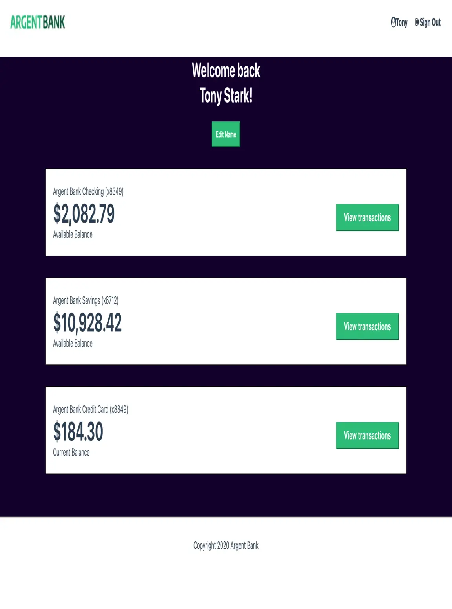

# ArgentBank

ArgentBank est une application bancaire en ligne permettant aux utilisateurs de gérer leurs transactions, consulter et modifier 
leur profil, et accéder à des informations financières en toute sécurité. Ce projet utilise une combinaison de **React**, **Redux Toolkit**, 
et **Axios** pour offrir une expérience utilisateur fluide et une gestion d'état efficace.

## Fonctionnalités

- **Authentification des utilisateurs** : Connexion sécurisée à l'aide de tokens JWT.
- **Gestion de profil** : Consultation et modification des informations personnelles.
- **Gestion des transactions** : Visualisation des transactions par mois, détails des transactions, ajout de notes et de catégories.
- **Sécurité des données** : Les transactions et profils utilisateurs sont sécurisés via des appels API protégés.

## Technologies utilisées

- **React** : Framework JavaScript pour la construction d'interfaces utilisateur dynamiques.
- **Redux Toolkit** : Gestion centralisée de l'état pour simplifier l'architecture et la gestion des données complexes.
- **Axios** : Bibliothèque pour effectuer des requêtes HTTP vers l'API.
- **Swagger** : Documentation de l'API REST pour une meilleure intégration et compréhension.

## Prérequis

- **Node.js** (version 12 ou supérieure)
- **npm** (version 6 ou supérieure)
- **API Backend** (vous pouvez utiliser l'API fournie ou configurer la vôtre)

## Installation

1. Clonez le dépôt Git :
   ```bash
   git clone https://github.com/zaaine-aziz/argent-bank.git

# ArgentBank

ArgentBank est une application bancaire en ligne permettant aux utilisateurs de gérer leurs transactions, consulter et modifier leur profil, et accéder à des informations financières en toute sécurité. Ce projet utilise une combinaison de **React**, **Redux Toolkit**, et **Axios** pour offrir une expérience utilisateur fluide et une gestion d'état efficace.

## Fonctionnalités

- **Authentification des utilisateurs** : Connexion sécurisée à l'aide de tokens JWT.
- **Gestion de profil** : Consultation et modification des informations personnelles.
- **Gestion des transactions** : Visualisation des transactions par mois, détails des transactions, ajout de notes et de catégories.
- **Sécurité des données** : Les transactions et profils utilisateurs sont sécurisés via des appels API protégés.

## Technologies utilisées

- **React** : Framework JavaScript pour la construction d'interfaces utilisateur dynamiques.
- **Redux Toolkit** : Gestion centralisée de l'état pour simplifier l'architecture et la gestion des données complexes.
- **Axios** : Bibliothèque pour effectuer des requêtes HTTP vers l'API.
- **Swagger** : Documentation de l'API REST pour une meilleure intégration et compréhension.

## Prérequis

- **Node.js** (version 12 ou supérieure)
- **npm** (version 6 ou supérieure)
- **API Backend** (vous pouvez utiliser l'API fournie ou configurer la vôtre)



By ZAAINE AZIZ
